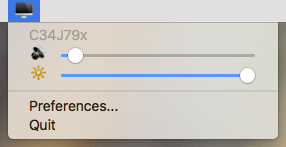

# MonitorControl

Control your external monitor brightness, contrast or volume directly from a menulet or with keyboard native keys



*Bonus: Using keyboard keys display the native osd :*


## Download

Go to [Release](https://github.com/lambourg/MonitorControl/releases/latest) and download the latest `.dmg`

## How to help

Open [issues](./issues) if you have a question, an enhancement to suggest or a bug you've found. If you want you can fork the code yourself and submit a pull request to improve the app.

## How to build

### Pre-requisite

- XCode
- [Cocoapods](https://cocoapods.org/)
- [SwiftLint](https://github.com/realm/SwiftLint) (optional)

First, clone the repository. Do not forget to use --recurse as there are submodules.

```sh
$ git clone --recurse https://github.com/lambourg/MonitorControl.git
```

Then download the dependencies with Cocoapods

```sh
$ cd MonitorControl
$ pod install
```

You're all set ! Now open the `MonitorControl.xcworkspace` with Xcode

### Third party dependencies

- [MediaKeyTap](https://github.com/the0neyouseek/MediaKeyTap)
- [MASPreferences](https://github.com/shpakovski/MASPreferences)

## Support
- macOS Sierra (`10.12`) and up.
- Works with monitors comptaible with [@kfix/ddcctl](https://github.com/kfix/ddcctl)

## Thanks
- [@bluejamesbond](https://github.com/bluejamesbond/) (Original developer)
- [@Tyilo](https://github.com/Tyilo/) (Fork)
- [@Bensge](https://github.com/Bensge/) - (Used some code from his project [NativeDisplayBrightness](https://github.com/Bensge/NativeDisplayBrightness))
- [@nhurden](https://github.com/nhurden/) (For the original MediaKeyTap)
- [@the0neyouseek](https://github.com/the0neyouseek/) (For the addition of the preferences window, OSD)
